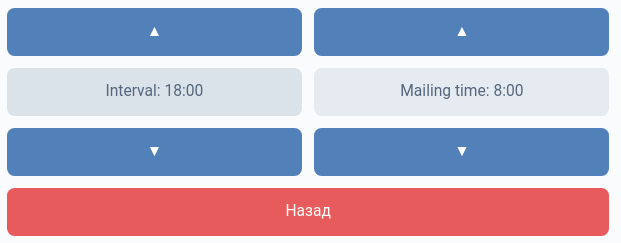

# !!IN_DEVELOPMENT!!

# VK-Fi

- Simple vk bot based on my own [r1-io](based on [vk-io]) to help monitor your Wi-Fi network

## Menus :
- Main Menu:

- Settings Menu:


## Setup
```
$ there will be setup of this repo
```

[r1-io]: <https://github.com/stercoris/r1-io>
[vk-io]: <https://github.com/negezor/vk-io>
