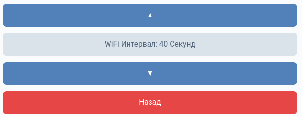
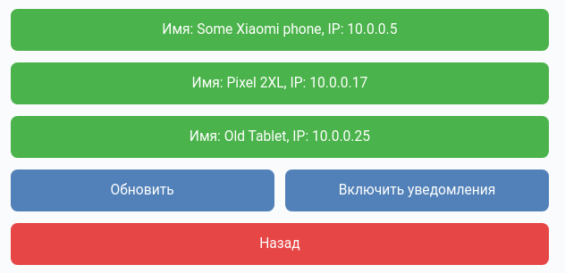

# VkFi

- Simple vk bot based on my own [r1-io](based on [vk-io]) library to help monitor your Wi-Fi network

## Menus :

- Main Menu:
  

  
  

- Settings Menu:
  

  
  

- Devices Menu:
  

  
  

[r1-io]: https://github.com/stercoris/r1-io
[vk-io]: https://github.com/negezor/vk-io
